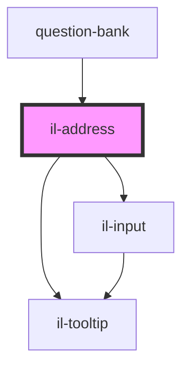

# il-address

<!-- Auto Generated Below -->

## Properties

| Property               | Attribute               | Description | Type      | Default                      |
| ---------------------- | ----------------------- | ----------- | --------- | ---------------------------- |
| `apiBaseUrl`           | `api-base-url`          |             | `string`  | `undefined`                  |
| `carrierAuthorization` | `carrier-authorization` |             | `string`  | `undefined`                  |
| `error`                | `error`                 |             | `string`  | `undefined`                  |
| `label`                | `label`                 |             | `string`  | `undefined`                  |
| `placeholder`          | --                      |             | `object`  | `{ address: 'Search ....' }` |
| `readOnly`             | `read-only`             |             | `boolean` | `undefined`                  |
| `required`             | `required`              |             | `boolean` | `undefined`                  |
| `tooltip`              | --                      |             | `String`  | `undefined`                  |
| `value`                | `value`                 |             | `any`     | `undefined`                  |

## Events

| Event          | Description | Type                  |
| -------------- | ----------- | --------------------- |
| `valueBlur`    |             | `CustomEvent<Object>` |
| `valueChanged` |             | `CustomEvent<Object>` |

## Methods

### `debouncedMethod(searchText: any) => Promise<void>`

#### Returns

Type: `Promise<void>`

### `getOptions(text: any) => Promise<any>`

#### Returns

Type: `Promise<any>`

## Dependencies

### Used by

 - [question-bank](../question-bank)

### Depends on

- [il-tooltip](../il-tooltip)
- [il-input](../il-input)

### Graph

----------------------------------------------

*Built with [StencilJS](https://stenciljs.com/)*
