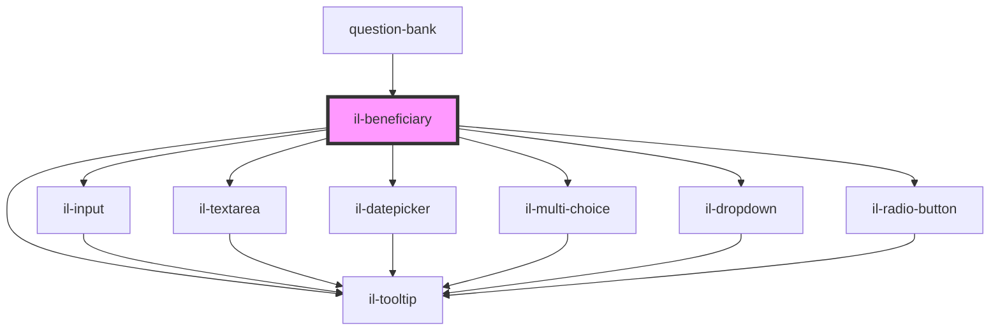

# il-beneficiary

<!-- Auto Generated Below -->

## Properties

| Property               | Attribute     | Description | Type       | Default     |
| ---------------------- | ------------- | ----------- | ---------- | ----------- |
| `blurUpdateAnswerType` | --            |             | `string[]` | `undefined` |
| `customColumns`        | --            |             | `object[]` | `undefined` |
| `error`                | `error`       |             | `string`   | `undefined` |
| `label`                | `label`       |             | `string`   | `undefined` |
| `maxLength`            | `max-length`  |             | `number`   | `1000`      |
| `minLength`            | `min-length`  |             | `number`   | `undefined` |
| `questionId`           | `question-id` |             | `number`   | `undefined` |
| `required`             | `required`    |             | `boolean`  | `undefined` |
| `tooltip`              | --            |             | `String`   | `undefined` |
| `value`                | `value`       |             | `string`   | `undefined` |

## Events

| Event                     | Description | Type                  |
| ------------------------- | ----------- | --------------------- |
| `beneficiaryValueBlur`    |             | `CustomEvent<object>` |
| `beneficiaryValueChanged` |             | `CustomEvent<object>` |

## Dependencies

### Used by

 - [question-bank](../question-bank)

### Depends on

- [il-input](../il-input)
- [il-textarea](../il-textarea)
- [il-datepicker](../il-datepicker)
- [il-multi-choice](../il-multi-choice)
- [il-dropdown](../il-dropdown)
- [il-radio-button](../il-radio-button)
- [il-tooltip](../il-tooltip)

### Graph

----------------------------------------------

*Built with [StencilJS](https://stenciljs.com/)*
