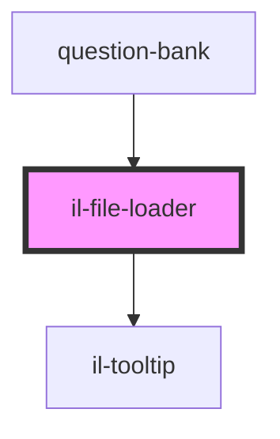

# il-file-loader

<!-- Auto Generated Below -->

## Properties

| Property           | Attribute            | Description | Type      | Default     |
| ------------------ | -------------------- | ----------- | --------- | ----------- |
| `checkboxText`     | `checkbox-text`      |             | `string`  | `undefined` |
| `error`            | `error`              |             | `string`  | `undefined` |
| `fileResponseList` | `file-response-list` |             | `any`     | `undefined` |
| `isShowCheckbox`   | --                   |             | `Boolean` | `undefined` |
| `label`            | `label`              |             | `string`  | `undefined` |
| `readOnly`         | `read-only`          |             | `boolean` | `undefined` |
| `required`         | --                   |             | `Boolean` | `undefined` |
| `selectedValue`    | `selected-value`     |             | `any`     | `undefined` |
| `tooltip`          | --                   |             | `String`  | `undefined` |

## Events

| Event          | Description | Type                   |
| -------------- | ----------- | ---------------------- |
| `valueChanged` |             | `CustomEvent<Boolean>` |

## Dependencies

### Used by

 - [question-bank](../question-bank)

### Depends on

- [il-tooltip](../il-tooltip)

### Graph

----------------------------------------------

*Built with [StencilJS](https://stenciljs.com/)*
