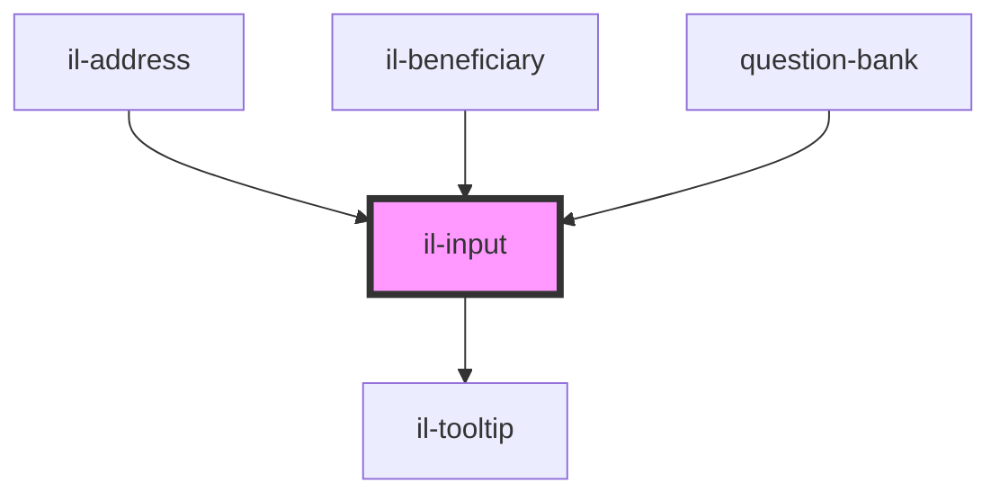

# il-input

<!-- Auto Generated Below -->

## Properties

| Property       | Attribute     | Description | Type      | Default     |
| -------------- | ------------- | ----------- | --------- | ----------- |
| `error`        | `error`       |             | `string`  | `undefined` |
| `label`        | `label`       |             | `string`  | `undefined` |
| `mask`         | `mask`        |             | `any`     | `undefined` |
| `placeholder`  | `placeholder` |             | `string`  | `undefined` |
| `questionType` | --            |             | `String`  | `undefined` |
| `readOnly`     | `read-only`   |             | `boolean` | `undefined` |
| `required`     | `required`    |             | `boolean` | `undefined` |
| `tooltip`      | --            |             | `String`  | `undefined` |
| `type`         | `type`        |             | `string`  | `'text'`    |
| `value`        | `value`       |             | `string`  | `undefined` |

## Events

| Event          | Description | Type                  |
| -------------- | ----------- | --------------------- |
| `valueBlur`    |             | `CustomEvent<string>` |
| `valueChanged` |             | `CustomEvent<string>` |

## Dependencies

### Used by

 - [il-address](../il-address)
 - [il-beneficiary](../il-beneficiary)
 - [question-bank](../question-bank)

### Depends on

- [il-tooltip](../il-tooltip)

### Graph

----------------------------------------------

*Built with [StencilJS](https://stenciljs.com/)*
