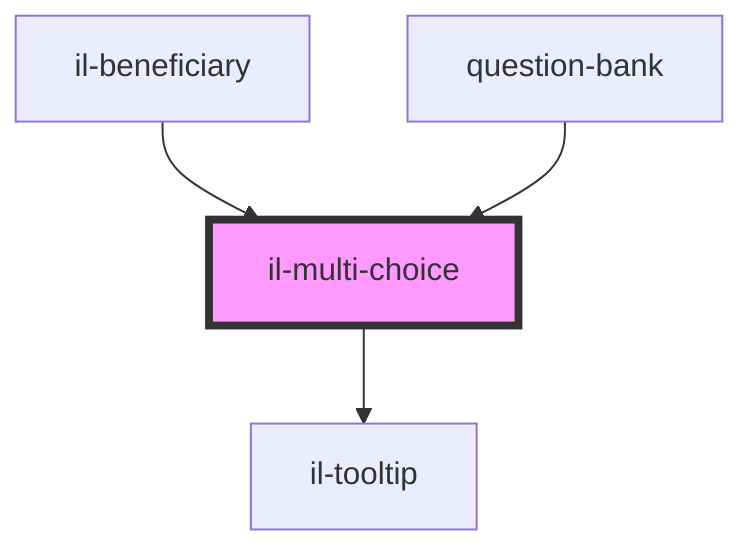

# il-multi-choice

<!-- Auto Generated Below -->

## Properties

| Property        | Attribute        | Description | Type                  | Default     |
| --------------- | ---------------- | ----------- | --------------------- | ----------- |
| `error`         | `error`          |             | `string`              | `undefined` |
| `isDefault`     | --               |             | `Object`              | `undefined` |
| `label`         | `label`          |             | `string`              | `undefined` |
| `options`       | --               |             | `HTMLOptionElement[]` | `[]`        |
| `readOnly`      | `read-only`      |             | `boolean`             | `undefined` |
| `required`      | --               |             | `Boolean`             | `undefined` |
| `selectedValue` | `selected-value` |             | `any`                 | `undefined` |
| `tooltip`       | --               |             | `String`              | `undefined` |

## Events

| Event          | Description | Type                    |
| -------------- | ----------- | ----------------------- |
| `valueChanged` |             | `CustomEvent<string[]>` |

## Dependencies

### Used by

 - [il-beneficiary](../il-beneficiary)
 - [question-bank](../question-bank)

### Depends on

- [il-tooltip](../il-tooltip)

### Graph

----------------------------------------------

*Built with [StencilJS](https://stenciljs.com/)*
