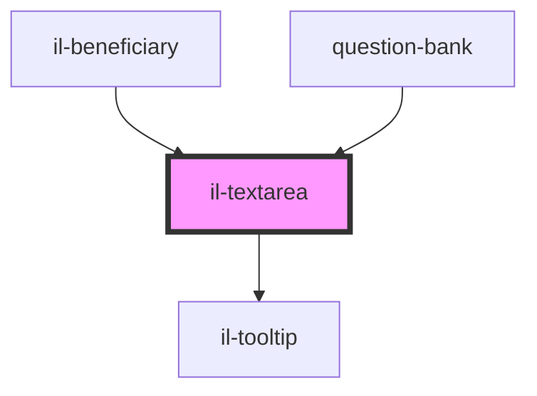

# il-textarea

<!-- Auto Generated Below -->

## Properties

| Property      | Attribute     | Description | Type      | Default     |
| ------------- | ------------- | ----------- | --------- | ----------- |
| `error`       | `error`       |             | `string`  | `undefined` |
| `label`       | `label`       |             | `string`  | `undefined` |
| `placeholder` | `placeholder` |             | `string`  | `undefined` |
| `readOnly`    | `read-only`   |             | `boolean` | `undefined` |
| `required`    | --            |             | `Boolean` | `undefined` |
| `tooltip`     | --            |             | `String`  | `undefined` |
| `value`       | `value`       |             | `string`  | `undefined` |

## Events

| Event          | Description | Type                  |
| -------------- | ----------- | --------------------- |
| `valueBlur`    |             | `CustomEvent<string>` |
| `valueChanged` |             | `CustomEvent<string>` |

## Dependencies

### Used by

 - [il-beneficiary](../il-beneficiary)
 - [question-bank](../question-bank)

### Depends on

- [il-tooltip](../il-tooltip)

### Graph

----------------------------------------------

*Built with [StencilJS](https://stenciljs.com/)*
