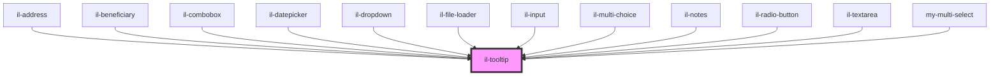

# il-tooltip

<!-- Auto Generated Below -->

## Properties

| Property  | Attribute | Description | Type     | Default     |
| --------- | --------- | ----------- | -------- | ----------- |
| `tooltip` | --        |             | `String` | `undefined` |

## Dependencies

### Used by

 - [il-address](../il-address)
 - [il-beneficiary](../il-beneficiary)
 - [il-combobox](../il-combobox)
 - [il-datepicker](../il-datepicker)
 - [il-dropdown](../il-dropdown)
 - [il-file-loader](../il-file-loader)
 - [il-input](../il-input)
 - [il-multi-choice](../il-multi-choice)
 - [il-notes](../il-notes)
 - [il-radio-button](../il-radio-button)
 - [il-textarea](../il-textarea)
 - [my-multi-select](../my-multi-select)

### Graph

----------------------------------------------

*Built with [StencilJS](https://stenciljs.com/)*
