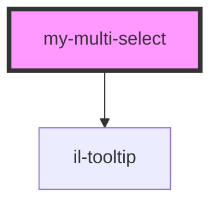

# my-multi-select

<!-- Auto Generated Below -->

## Properties

| Property      | Attribute     | Description | Type                  | Default     |
| ------------- | ------------- | ----------- | --------------------- | ----------- |
| `error`       | `error`       |             | `string`              | `undefined` |
| `label`       | `label`       |             | `string`              | `undefined` |
| `options`     | --            |             | `HTMLOptionElement[]` | `[]`        |
| `placeholder` | `placeholder` |             | `string`              | `undefined` |
| `required`    | --            |             | `Boolean`             | `undefined` |
| `tooltip`     | --            |             | `String`              | `undefined` |
| `values`      | --            |             | `string[]`            | `[]`        |

## Events

| Event           | Description | Type                    |
| --------------- | ----------- | ----------------------- |
| `valuesChanged` |             | `CustomEvent<string[]>` |

## Dependencies

### Depends on

- [il-tooltip](../il-tooltip)

### Graph

----------------------------------------------

*Built with [StencilJS](https://stenciljs.com/)*
