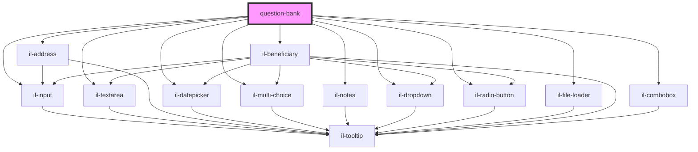

# question-bank

<!-- Auto Generated Below -->

## Properties

| Property               | Attribute               | Description | Type      | Default     |
| ---------------------- | ----------------------- | ----------- | --------- | ----------- |
| `apiBaseUrl`           | `api-base-url`          |             | `string`  | `undefined` |
| `applicationId`        | `application-id`        |             | `string`  | `undefined` |
| `carrierAuthorization` | `carrier-authorization` |             | `string`  | `undefined` |
| `client`               | `client`                |             | `string`  | `undefined` |
| `formId`               | `form-id`               |             | `string`  | `undefined` |
| `isFormValidation`     | `is-form-validation`    |             | `boolean` | `undefined` |
| `singleForm`           | `single-form`           |             | `boolean` | `undefined` |
| `userId`               | `user-id`               |             | `string`  | `undefined` |

## Methods

### `debouncedMethod(payload: any) => Promise<void>`

#### Returns

Type: `Promise<void>`

### `storeAnswerInQuestion(payload: any) => Promise<any>`

#### Returns

Type: `Promise<any>`

## Dependencies

### Depends on

- [il-input](../il-input)
- [il-textarea](../il-textarea)
- [il-address](../il-address)
- [il-datepicker](../il-datepicker)
- [il-multi-choice](../il-multi-choice)
- [il-notes](../il-notes)
- [il-dropdown](../il-dropdown)
- [il-radio-button](../il-radio-button)
- [il-file-loader](../il-file-loader)
- [il-beneficiary](../il-beneficiary)
- [il-combobox](../il-combobox)

### Graph

----------------------------------------------

*Built with [StencilJS](https://stenciljs.com/)*
